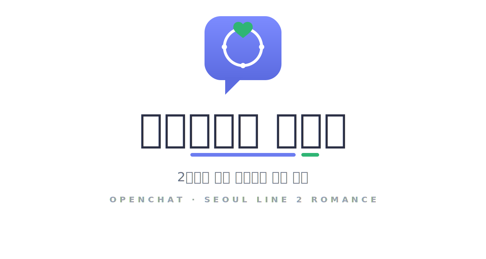

<div align="center">



# 오픈챗에서 만나요 *(가제)*

**오픈채팅으로 가볍게 시작한 썸들이, 결국 "나는 진심을 줄 수 있는 사람인가"를 묻게 되는 잠실발 2호선 청춘극.**

`Ren'Py` · `한국어` · `PC / 모바일 웹(HTML5)` · `개발 중`

</div>

---

> ⚠️ **이 게임은 "여러 여자와 썸타는 게임"이 아닙니다.**
> **연애에 서툴고 한 번 데인 20대 남자가, 오픈챗에서 만난 진짜 친구(도윤)를 통해 '진심'을 배워가는 이야기**입니다.
> 연애는 **소재**, 우정과 진심은 **주제**.

---

## 📖 한 줄 소개

플레이어는 잠실에 자취하는 20대 중반 사회초년생이 되어, 가상 오픈채팅 앱 **'마실'**에 발을 들입니다.
가볍게 어장처럼 굴 수도, 한 사람에게 진심을 줄 수도 있습니다. 그 선택이 곁에 누가 남는지를 가릅니다.

- **타깃:** 모태솔로를 재밌게 했고, 연애에 데여본 적 있는 20대.
- **톤:** 가벼운 오픈챗 코미디 표면 + 우정·진심 드라마 코어.
- **배경:** 서울 — 거점 잠실, 2호선 순환선을 따라 신촌·성수·문래·강남 등으로 세계가 넓어짐. *(실제 장소 차용, 인물·사건은 전부 픽션)*

---

## ✨ 특징

| | |
|---|---|
| 💬 **마실 채팅 UI** | 카톡류를 베끼지 않은 독자 디자인의 메신저 화면. 말풍선·타임스탬프·'읽음'·입력중 애니메이션·프사. 반응형이라 PC/모바일 웹에서 안 깨짐. |
| ⏱ **답장 타이밍 / 읽씹** | 상대 톡에 `바로 / 뜸 들이고 / 못 본 척`. **상대마다 다르게 읽혀** 정답이 하나가 아님(서아=빠름이 설렘, 지우=신중함이 진심, 민결=빠름은 경계). |
| ❤️ **호감 ≠ 진심 (이중 수치, 비표시)** | "잘 보이긴 쉽고 진심은 비싸다"를 시스템으로. **숫자는 일부러 숨김** — 점수질이 되는 순간 주제가 죽으니까. 대신 도윤의 말과 친구목록의 '결'로 간접 표현. |
| 🧑‍🤝‍🧑 **도윤 — 진짜 주인공급 동생** | 모든 화를 관통하는 상수. 상담으로 힌트를 주고, 우정이 깊어질수록 조언이 더 정확해짐(우정 우선을 보상). |
| 🚇 **2호선 맵** | 거점 잠실에서 출발, 진행에 따라 역이 해금되며 "내가 아는 그 동네"의 현실감. |
| 🎁 **아이템 / 추억함** | 벚꽃 엽서·도윤의 키링·폴라로이드… 건네고 간직한 물건이 분기와 정서를 만든다. |
| 📊 **엔딩 진단 + 거울 통계** | 엔딩 후 "당신은 ___형"(진심파/어장러/도망러/의리파/슬로우버너) + 통계 카드(공유용). |
| 🏆 **7가지 엔딩 + 갤러리** | 진/굿/어장/도윤 우정/화해 진/쓸쓸/도피. 회차를 넘어 수집 기록 유지. |

---

## 🗺 진행 구조

```
[프롤로그]  오픈챗 첫 입장 · 주인공의 결함(외로움·데인 과거) · 도윤과 '그 술자리 밤'
[Ep.1] 서아  — 빠르게 불타는 썸        (신촌)
[Ep.2] 도윤  — 문래, 그 골목의 밤      (우정 심화 · 과거의 암시)
[Ep.3] 지우  — 천천히 진짜가 되는      (성수 슬로우번)
[Ep.4] 민결  — 돌아온 이름            (후반 반전 · 친구 vs 사랑 딜레마 · 4지선다 결말)
[에필로그]  누적된 진심·우정에 따라 마무리 분기 + 연애 유형 진단
```

- **분량:** 한 회차 약 **13,000자 내외 / 플레이 ~40–55분**(분기 선택 ~48개, 채팅 ~100개).
- 시간순 옴니버스 + 진심·우정 누적. 매 화 끝 도윤의 코멘트로 누적 감각을 줌.

---

## 🚀 실행하기

이 저장소의 `.rpy` 파일들은 **Ren'Py 프로젝트의 `game/` 폴더에 넣는 구성**입니다.

1. **[Ren'Py SDK 8.x](https://www.renpy.org/)** 설치 → 런처에서 새 프로젝트 생성(권장 해상도 1280×720).
2. 이 저장소의 `*.rpy` 와 (있다면) `images/`·`audio/` 를 프로젝트의 `game/` 폴더에 복사.
3. **시작 라벨 지정** — `game/` 어딘가(예: `script.rpy`)에 다음을 두세요:
   ```renpy
   label start:
       jump episode1_full
   ```
   > 현재 각 스크립트의 `label start` 는 주석 처리돼 있습니다. 위 한 줄이 있어야 게임이 시작됩니다.
4. **한글 폰트** — 웹 빌드는 시스템 폰트를 못 믿습니다. `gui.rpy` 에서 한글 폰트(Noto Sans KR/Pretendard 등)를 지정하세요. (안 하면 웹에서 한글이 깨짐)
5. 런처에서 **Launch Project** 로 실행, 또는 아래로 웹 배포.

### 🌐 웹 배포 (GitHub → Vercel)

Ren'Py 런처의 **Web(beta)** 빌드 → 산출물(`...-web/`)을 GitHub에 push → Vercel로 자동 배포.
COOP/COEP 헤더(`vercel.json`)·모바일/iOS 주의사항 등 전체 절차는 **[웹배포가이드](웹배포가이드_github_vercel.md)** 참고.

> 게임 내 우상단 **📱 버튼**으로 친구목록 / 추억함 / 갤러리에 접근할 수 있습니다.

---

## 📁 프로젝트 구조

### 본편 스크립트
| 파일 | 내용 |
|---|---|
| `script_ep1.rpy` | 프롤로그 + Ep.1(서아). 진입점 `label episode1_full` |
| `script_ep2.rpy` | Ep.2(도윤) — 우정·거울 구조 |
| `script_ep3.rpy` | Ep.3(지우) — 슬로우번 |
| `script_ep4.rpy` | Ep.4(민결) — 반전·4엔딩 |
| `script_epilogue.rpy` | 에필로그 + 엔딩 분기 + 진단카드 호출 |

### UI 화면
| 파일 | 내용 |
|---|---|
| `screens_chat.rpy` | 마실 채팅 UI(반응형·타임스탬프·프사·입력중) |
| `screens_map.rpy` | 2호선 노선도 맵(역 해금/이동) |
| `screens_meta.rpy` | 친구목록 · 엔딩 진단카드 · 추억함 · 갤러리 · 폰 메뉴 · 도윤 푸시 토스트 |

### 시스템
| 파일 | 내용 |
|---|---|
| `systems_affection.rpy` | 호감/진심/우정 게이지, 도윤 상담, 엔딩 판정(`final_ending`) |
| `systems_items.rpy` | 아이템 / 인벤토리 |
| `systems_reply.rpy` | 답장 타이밍 / 읽씹 (`reply_prompt`) |
| `systems_extra.rpy` | 관계 라벨 · 연애 유형 진단 · 거울 통계 · 엔딩 수집 · 맥거핀 플래그 |

### 연출 · 설정
| 파일 | 내용 |
|---|---|
| `effects.rpy` | 안전 사운드 헬퍼(에셋 없어도 무음) · 트랜지션 · 앰비언스 채널 |
| `config_web_mobile.rpy` | 웹/모바일 보정(터치 확대) · `scene black` 등 안전장치 |

### 문서 · 에셋
| 파일 | 내용 |
|---|---|
| [`기획서_오픈챗연애_v2.md`](기획서_오픈챗연애_v2.md) | 최신 기획서(포지셔닝·인물·구조·게이지 설계) |
| [`검토리포트_적대적분석.md`](검토리포트_적대적분석.md) | 출시 전 적대적 검토 리포트 |
| [`에셋_이미지_전체리스트.md`](에셋_이미지_전체리스트.md) | 필요 이미지 마스터 체크리스트(배경 직접 촬영 가이드 포함) |
| [`에셋_사운드_전체리스트.md`](에셋_사운드_전체리스트.md) | 필요 BGM/SE 전체 목록 |
| [`이미지생성_프롬프트집.md`](이미지생성_프롬프트집.md) | AI 이미지 생성 프롬프트 모음 |
| [`제작가이드_그래픽_사운드.md`](제작가이드_그래픽_사운드.md) | 에셋 제작/적용 가이드 |
| [`웹배포가이드_github_vercel.md`](웹배포가이드_github_vercel.md) | 웹 빌드·배포·모바일 테스트 |
| `타이틀로고_마실.svg` · `앱아이콘_마실*.svg/png` · `app_icon.ico` | 로고/아이콘 |

---

## 🎨 에셋 현황

- 현재 배경은 전부 **단색 플레이스홀더**(`Solid`)라 **에셋 없이도 흐름이 끝까지 돌아갑니다.**
- 채팅 프사는 `images/avatar/avatar_doyun.png` 식으로 넣으면 **자동 연결**, 없으면 이니셜 동그라미로 대체.
- 효과음(`audio/se/`)·BGM(`audio/bgm/`)도 파일을 넣는 순간 자동 재생(없으면 무음).
- 무엇을 몇 개 만들/찍어야 하는지는 → **에셋 리스트 문서**(위 표) 참고.

> **저작권/상표:** 실제 메신저(이름·로고·색·알림음)·실존 상호/간판/인물은 사용 금지. 외부 에셋은 상업·내장 허용 여부를 확인하고 `CREDITS.txt` 에 출처·라이선스 기록.

---

## ✅ 상태 & 로드맵

- [x] 프롤로그 + Ep.1~4 + 에필로그 초고 (전 분기·7엔딩)
- [x] 마실 채팅 UI / 2호선 맵 / 호감·진심·우정 / 아이템 / 도윤 상담
- [x] 매력 요소: 답장 타이밍 · 친구목록 대시보드 · 엔딩 진단/통계/추억함 · 갤러리 · 도윤 푸시 · 이스터에그 · 맥거핀
- [ ] **Ren'Py 실행/lint 검증** *(아직 미실행 — 런처에서 `Build → lint` + 플레이 확인 필요)*
- [ ] 배경 사진/일러스트 · 캐릭터 스프라이트 · BGM/SE · 이벤트 CG
- [ ] 타이틀/메인메뉴 화면, 웹 presplash, 한글 폰트 내장
- [ ] (선택) 주말 시간 배분 시스템(맵을 '어장 vs 진심' 엔진으로)

---

## 🙏 크레딧

기획·시나리오·시스템 설계 · *(에셋·폰트 추가 시 여기에 출처/라이선스 명기)*

> 첫 작품. "완성이 제일 어렵다" — 흐름 완성 → 에셋 교체 순서로 갑니다.
